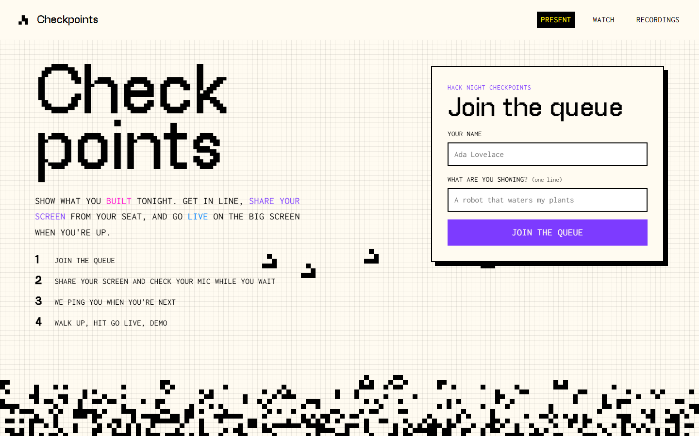

# Checkpoints MVP

A working prototype of the Hack Night checkpoint queue, styled like purduehackers.com. Hackers join a queue from their seats, pick their screen while they wait, and go live on the projector when called. The organizer runs the queue and the stopwatch from an admin page. Every share is recorded.

This is a quick prototype. It doesn't use the stack in the PRD; see "How it is built" below. The plan to rebuild it properly is in [`../docs/MVP_PLAN.md`](../docs/MVP_PLAN.md).



## Start it

You need **Node 18 or newer**. Nothing needs to be installed.

```
cd MVP
node server.mjs
```

Then open **http://localhost:4747**.

| Page | URL | Who uses it |
|---|---|---|
| Join the queue, share your screen, check your mic | http://localhost:4747/ | Hackers |
| Projector: a waiting screen, then the live share | http://localhost:4747/view | The room |
| Admin: stopwatch, next person, stop sharing, queue | http://localhost:4747/admin | Organizers |
| Recordings of past shares | http://localhost:4747/recordings | Everyone |
| Earlier design experiments, all on the same queue | http://localhost:4747/designs | Developers |

- To use another port, run `PORT=5000 node server.mjs`.
- Recordings are saved to `MVP/recordings/`. That folder is git-ignored and never committed.
- Use Chrome or Edge. Sharing a tab's audio only works in Chromium browsers.

### Other laptops on the network

Browsers only allow screen sharing on `localhost` or over HTTPS. To let other laptops join, put the server behind an HTTPS tunnel, for example:

```
cloudflared tunnel --url http://localhost:4747
```

Then share the `https://…trycloudflare.com` link. The projector's waiting screen shows whatever address it was opened on.

### Test the whole flow automatically

```
npm install            # installs Playwright (only needed for the test)
npx playwright install chromium
node server.mjs        # in one terminal
npm run test:e2e       # in another
```

The test uses a fake screen and fake mics:
1. Two people join, and one shares from the queue.
2. The admin calls them up, and they go live.
3. The test checks that the projector and the admin both receive the video.
4. The admin stops the share, and the test checks the recording was saved.

Screenshots go to `screenshots/`. **Note:** the test leaves a real recording named "Ada" in `recordings/`. Delete it afterwards.

## How to run a checkpoint

1. Open `/view` on the projector laptop. Press **F** for fullscreen, then click **Turn sound on**.
2. Open `/admin` on the organizer's laptop.
3. Hackers open `/`, enter their name and project, and join.
4. While they wait, hackers press **Share screen** to pick a window; only they can see the preview. The queue then shows them as **screen ready**.
5. Hackers press **Find my mic** and talk. Every input lights up when it hears them. They can click one, or leave auto-switch on.
6. The person next in line gets a beep and a page flash.
7. The organizer presses **Next person**. The hacker gets a beep, a notification and a **Go live** button. Pressing it puts their screen on the projector.
8. The organizer watches the stopwatch. It turns amber near the limit and pink after it. **Stop sharing** ends the share, and **Next person** moves on.
9. The recording uploads when the share ends and shows up at `/recordings`.

## What was built from the design docs

The design docs are [`../PRD.docx`](../PRD.docx) and [`../docs/USER_STORIES.md`](../docs/USER_STORIES.md). The tables below compare this MVP against them.

### PRD "MVP Goals"

| PRD item | Status | Notes |
|---|---|---|
| **Client:** base page for joining the queue | Done | `/` |
| **Client:** enter name and join code | Done | Name and project. The team has since dropped join codes (US-2.1 is struck out), so there is no code. There are no sessions either: one global queue. |
| **Client:** queue page with a screenshare prompt and queue number | Done | Shows "#N" and the number of people ahead. People can share from their seat with a private preview. |
| **Client:** confirmation step before going live | Partly | When called, the card switches to a big **Go live** button. It isn't a dimmed full-page overlay. |
| **Client:** screenshare with a timer on your turn | Done | The presenter, projector and admin all see the stopwatch. |
| **Client:** screen shuts off automatically when time is up | **Missing** | The stopwatch only changes color. The organizer has to press Stop. |
| **Client:** button to end your checkpoint | Done | "I'm done" |
| **Admin:** panel showing everyone in the queue | Done | Includes a "screen ready" tag for people who have already picked a screen. |
| **Admin:** view the screenshare | Partly | The admin sees the live share. **Shares can't be previewed before they go live.** |
| **Admin:** remove people from the queue | Done | Admins can also move people up. |
| **Host:** join code and queue list | Done | Shows the join address and the up-next list. Join codes were dropped from the user stories, so the address replaces the code. |
| **Host:** screenshare with the presenter's name | Done | The name, project and stopwatch are in a bar under the share. |
| **Host:** "screensaver" between checkpoints | Done | Purdue Hackers grid with a Game of Life glider band, and the up-next list. |

### PRD "Finished Product Goals"

| PRD item | Status |
|---|---|
| Squid login, no name box | Missing |
| Past checkpoints on the home page, with a badge-style artifact and a video player | Partly. A separate `/recordings` page has a video player for each share. Not on the home page; no badge. |
| Recording | Partly. The browser records screen, mic and tab audio and saves it on the server. The PRD's OBS/camera pipeline and Cloudflare R2 storage aren't built. |
| "Allow checkpoint to be recorded" checkbox | **Missing. Every share is recorded and listed publicly.** Add consent before using this at a real event. |
| Location check (geolocation or IP) | Missing |
| Preview of your shared screen while in the queue | Done |
| Change the screenshare window | Partly. Possible before going live, not while live. |
| Exit the queue | Done |
| Change project name while queued | Missing |
| Ask for the microphone; change the mic input | Done, plus automatic detection of the mic that hears you |
| Stream quality setting | Missing |
| Name and project shown at the top while presenting | Partly. Shown in a bar under the share instead. |
| Admin: warn or ban users, message modal, "punished" portal | Missing |
| Admin: rearrange the queue | Partly. Move up only. |
| Admin: allow a re-present (block re-joining by default) | Missing. Anyone can re-join. |
| Host: smooth transitions, checkpoint counter, podium camera, "Shh" screen, celebration end screen | Missing |

### User stories ([`../docs/USER_STORIES.md`](../docs/USER_STORIES.md))

| Status | Stories |
|---|---|
| **Done** | US-1.2 (projector shows the join address and the live queue), US-2.2 (name and project), US-2.3 (live position, leave), US-3.2 (change window before going live), US-4.1 (up-next beep, notification and flash), US-4.3 (go live on the projector with a name bar), US-4.5 (end early), US-5.2 (queue overview), US-6.1 (screensaver), US-6.2 (live view, sound button, fullscreen, hidden cursor) |
| **Dropped by the team** | US-2.1 (join-code page) |
| **Partly** | US-2.4 (a refresh keeps your spot but you must pick your screen again), US-3.1 (share from your seat with a preview; the stream ID design is not used), US-3.3 (the share-stopped message works; the organizer only sees ready or not ready), US-4.2 (Go live button, no dimmed overlay), US-5.4 (Next, Remove and Stop exist; Skip doesn't), US-5.5 (move up and the time limit exist; drag-to-reorder doesn't) |
| **Missing** | US-0.1 to 0.3 (Astro, Elysia, Turso and WebSocket foundation), US-1.1 and US-1.3 (start and end a session), US-4.4 (server-enforced cutoff and last-15-second countdown), US-5.1 (admin passcode), US-5.3 (preview a share before it goes live), US-7.1 (HTTPS deployment), US-7.2 (dry run) |

## How it is built (and how it differs from the PRD)

| | This MVP | PRD plan |
|---|---|---|
| Server | `server.mjs`, Node built-ins only, no install | Elysia on Bun |
| Front end | Plain HTML and CSS per design. `public/core.js` holds all the logic. | Astro, React and Tailwind |
| State | In memory. **The queue resets when the server restarts.** Recordings persist on disk with `recordings/recordings.json` as the index. | Turso |
| Live updates | Pages poll `/api/poll` every 0.7s. (A Cloudflare tunnel buffers server-sent events, so polling is used.) | WebSocket |
| Video | Direct WebRTC from the presenter's browser to each viewer. Signalling goes through the server. Uses Google STUN with the public Open Relay TURN server as a fallback. | VDO.Ninja |
| Auth | **None.** Anyone who knows `/admin` can run the queue. | Squid |

### Files

```
MVP/
  server.mjs               queue, signalling relay, recording upload, page routing
  public/core.js           all client logic: queue, WebRTC, recording, mic scan, alerts, stopwatch
  public/contract.css      functional rules shared by every design
  public/designs/ph/       the default design (purduehackers.com style)
  public/designs/*/        earlier design experiments (hackers, wave, pixel, blueprint, nightshift, aloft-editorial)
  public/pages, themes/    the first four themes (boilermaker, terminal, zine, orbit)
  CONTRACT.md              the ids and classes a design must include for core.js to work
  tools/e2e.mjs            end-to-end test with fake media
  tools/capture.mjs        screenshots a site; with --mirror, saves its files for offline reference
  tools/serve.mjs          static server for a mirrored site
  screenshots/             screenshots of the MVP
  style-reference/         screenshots of purduehackers.com and waveforum.purduehackers.com
```

To make a new design, copy `public/designs/ph/`, keep the ids in `CONTRACT.md`, and open `/d/<name>/join`.

### The purduehackers.com style

Taken from the live site's CSS:
- **Background:** `#fffbf1` with a 10px grid of `#00000012` lines.
- **Colors:** primary `#7d3bff`, yellow `#fe0`, amber `#ffb700`, blue `#0084ff`, pink `#f0c`.
- **Fonts:** PixelHackers for headlines; Inconsolata, uppercase and semibold, for text.
- **Pixel buttons:** squares that flip to black in a random order on hover.

The font files are in `public/designs/ph/fonts/`. PixelHackers is Purdue Hackers' own font. Inconsolata and Silkscreen are under the SIL Open Font License.

The Wave Forum look:
- **Background** `#050507`, **text** `#f4f4f6`, **highlight** `#b48cff`.
- **Fonts:** Oscilloscope for the title and Geist for body text.
- **Background art:** a WebGL "spray" shader.

The full mirrors of both sites aren't committed. Run `node tools/capture.mjs <url> <dir> --mirror` to make one locally.

## Known issues

- One global queue; no sessions.
- The queue is lost when the server restarts.
- No admin login.
- No automatic cutoff at the time limit.
- No recording consent. Every share is recorded.
- People who leave the tab for more than about 2.5 minutes drop out of the queue.
- Phones can join the queue but can't share their screen (mobile browsers don't support it).
